# ⚙️ Automatização de Componentes Mecânicos 3D: Uma Abordagem Integrando IA e Ferramentas Open-Source

Este repositório contém o código-fonte e os artefatos de validação da Iniciação Científica desenvolvida no Instituto Federal do Espírito Santo (Ifes) - Campus Aracruz. O projeto propõe uma arquitetura inovadora de software capaz de automatizar o ciclo de vida do projeto mecânico a partir de descrições em linguagem natural.

## 🚀 Arquitetura do Sistema

O sistema integra Inteligência Artificial Generativa com ferramentas *open-source* de engenharia, atuando em quatro pilares fundamentais:

**1. Processamento Semântico (Gemini API):** O LLM é restrito à função de extrator de dados, mapeando textos para matrizes JSON. O motor Fallback garante resiliência contra falhas.

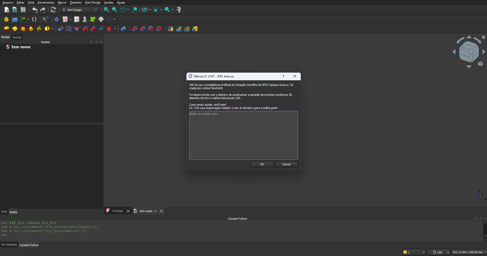

**2. Modelação Paramétrica e CSG:** Geração de sólidos via Geometria Construtiva de Sólidos e operações booleanas exatas.

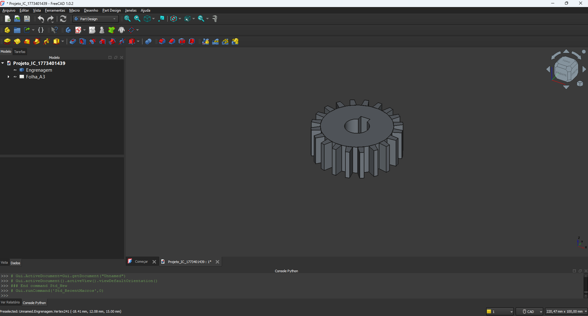

**3. Detalhamento Técnico Automático (TechDraw):** Criação dinâmica e escalonamento de pranchas normatizadas no FreeCAD.

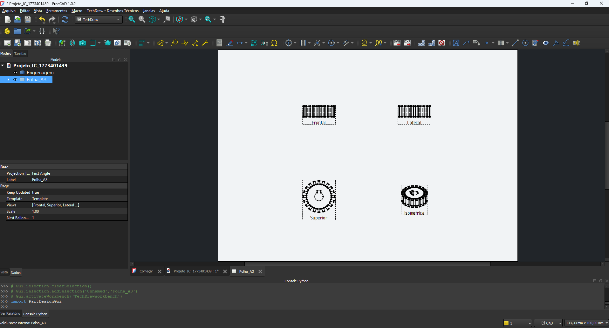

**4. Bypass CAE C++ (Gmsh):** Fatiamento volumétrico invisível e injeção nativa de malhas tetraédricas prontas para simulação.

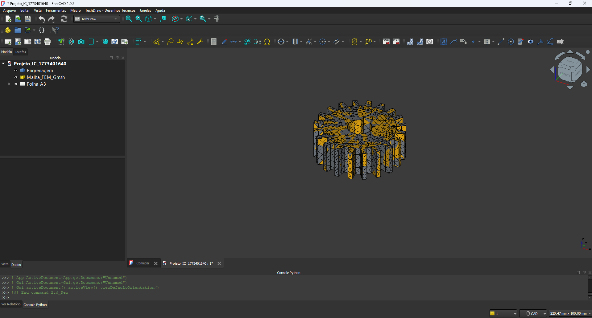

## 📁 Estrutura do Repositório

* `/src` - Script em Python (`Fabrica_IC_V197.py`) contendo a lógica de integração CAD/CAE.
* `/docs` - Pranchas de detalhamento técnico exportadas automaticamente (PDF).
* `/assets` - Capturas de tela do sistema, modelação paramétrica e renderização das malhas de elementos finitos.

## 🛠️ Tecnologias Utilizadas
* **FreeCAD 1.0** (API Python e CSG)
* **Gmsh** (Fatiamento Volumétrico e formato UNV)
* **Google Gemini Pro** (Via Google AI Studio)
* **PySide** (Interface Gráfica de Usuário - GUI)

## 🧩 Galeria de Componentes Gerados (Validação CSG)

Abaixo estão as 9 famílias de componentes mecânicos paramétricos gerados integralmente de forma autônoma pelo sistema, validando a eficácia das operações de Geometria Construtiva de Sólidos (CSG) a partir de descrições em linguagem natural:

  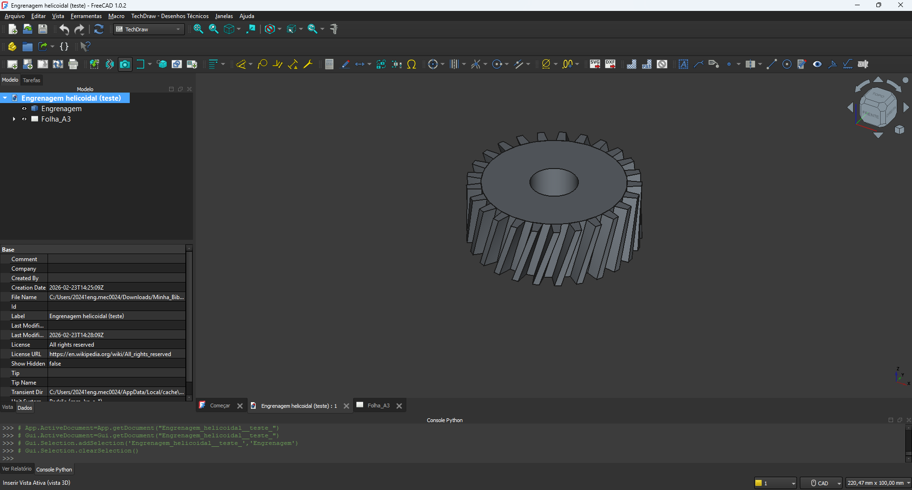
  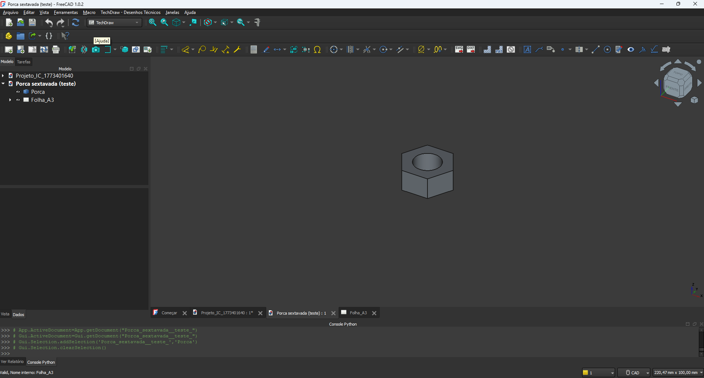
  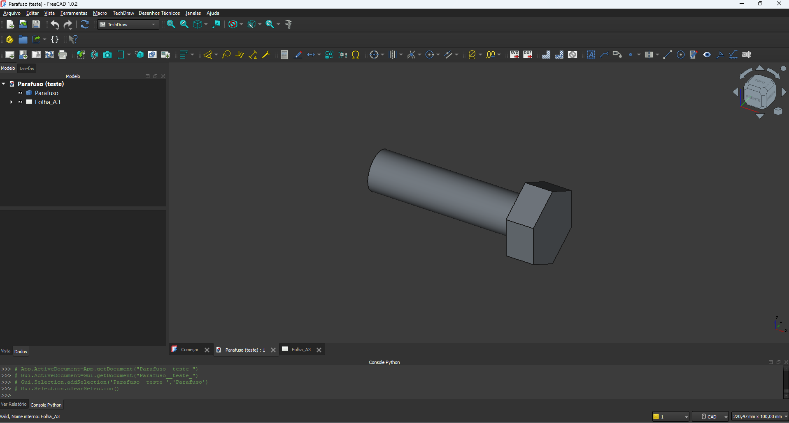

  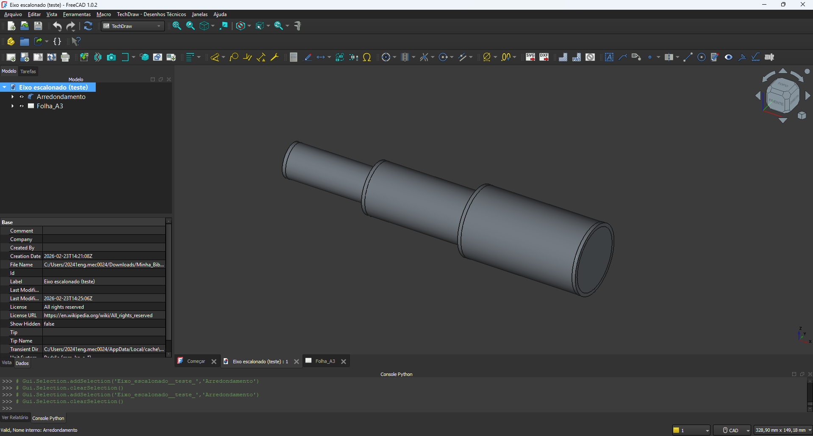
  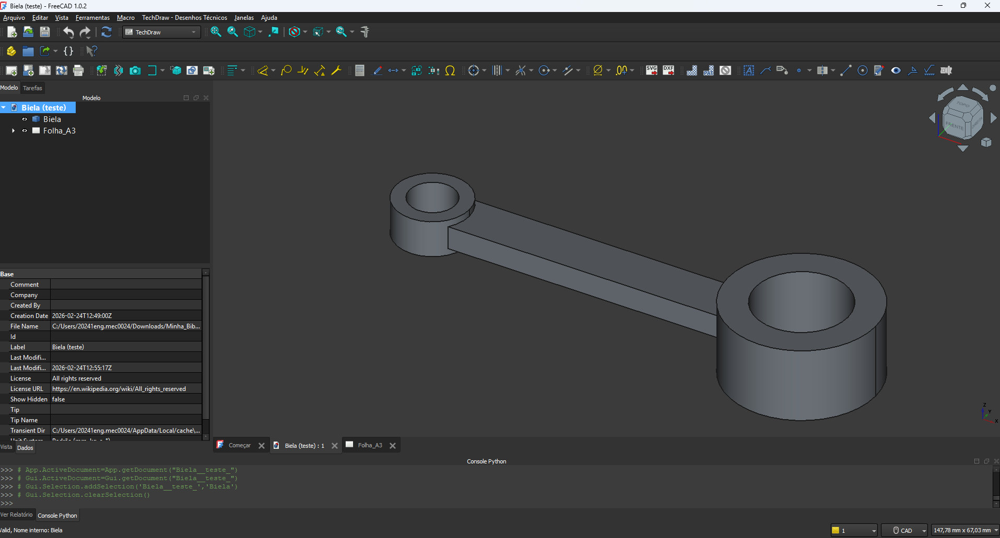
  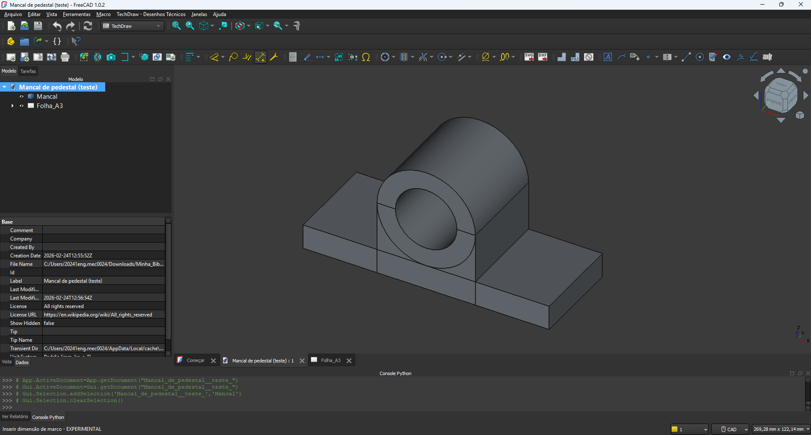

  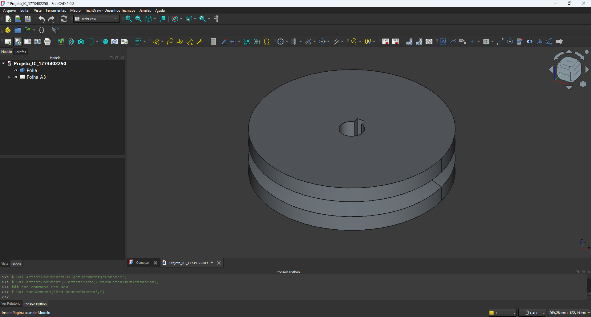
  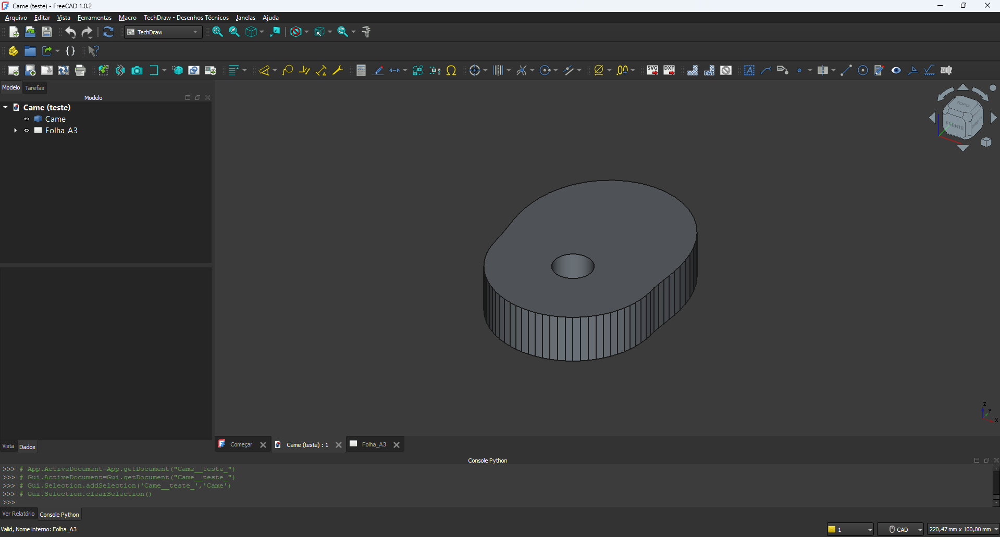
  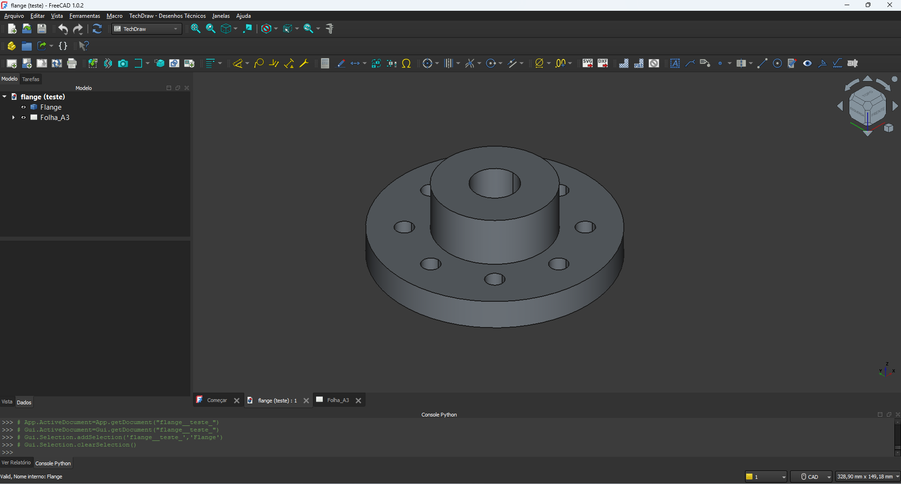

## ⚙️ Como Executar

1. Instale o [FreeCAD 1.0](https://www.freecadweb.org/) (necessário para o bypass nativo do Gmsh).
2. Abra o console Python dentro do próprio FreeCAD (Menu Exibir > Painéis > Console Python) e instale a biblioteca da IA digitando o comando exato abaixo e apertando Enter:
   `import subprocess, sys; subprocess.run([sys.executable, '-m', 'pip', 'install', 'google-generativeai'])`
3. Obtenha uma chave de API gratuita no [Google AI Studio](https://aistudio.google.com/) e cole-a na variável `API_KEY` do código.
4. Abra o arquivo `Fabrica_IC_V197.py` no editor de macros do FreeCAD e execute (botão Play).
5. Na interface gerada, digite o seu comando em linguagem natural (ex: *"Crie uma engrenagem módulo 2 com 20 dentes e gere a malha"*).

---
*Pesquisa desenvolvida sob a linha de Adoção de Tecnologias Digitais na Gestão de Projetos Mecânicos.*
